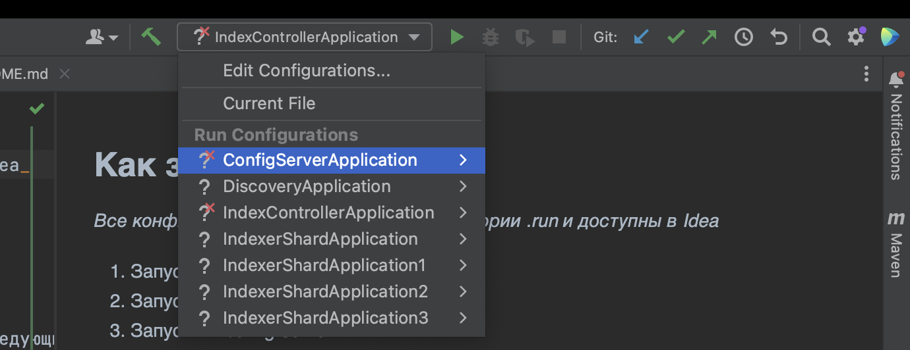

## Как запустить из Idea

_Все конфигурации уже сохранены в директории .run и доступны в Idea_

_Если вы используете Idea Community Edition, то выбирайте соответствующие конфигурации (с суффиксом IdeaCommunity)_

1. Запустить index-controller
2. Запустить несколько нод index-shard, передавая в параметрах следующие аргументы:
    * --server.port=8082 (порт можно выбрать любой)
    * --application.shard.name=shard1 (имя можно выбрать любое)
3. Открыть браузер http://localhost:8080/

## Как запустить новый shard из командной строки

1. Открыть файл launch_shard (не windows) или launch_shard.cmd (windows) в текстовом редакторе
2. Поменять следующие параметры запуска:
    * --master_host=localhost  // ip адрес мастер хоста, можно узнать у лектора
    * --server.port=8050 // Произвольный незанятный на машине порт
    * --application.shard.name=xxx // имя шарда, произвольная строка

